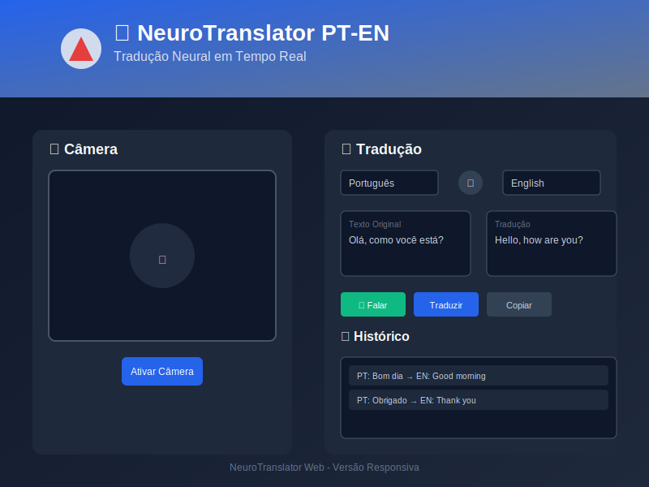

# 🧠 NeuroTranslator PT-EN

<div align="center">
  
[](https://github.com/flaviohenriquehb777/NeuroTranslator_PT_EN/blob/main/LICENSE.md)
[](https://flaviohenriquehb777.github.io/NeuroTranslator_PT_EN/)
[](https://github.com/flaviohenriquehb777/NeuroTranslator_PT_EN)

</div>

## 📋 Sumário

- [Visão Geral](#-visão-geral)
- [Aplicação Web](#-aplicação-web)
- [Principais Funcionalidades](#-principais-funcionalidades)
- [Arquitetura do Sistema](#️-arquitetura-do-sistema)
- [Estrutura do Projeto](#-estrutura-do-projeto)
- [Instalação e Uso](#-instalação-e-uso)
- [Desenvolvimento](#-desenvolvimento)
- [Contribuição](#-contribuição)
- [Licença](#-licença)

---

<div align="center">
  <a href="https://flaviohenriquehb777.github.io/NeuroTranslator_PT_EN/">
    
  </a>
</div>

<div align="center">
  <strong>🚀 <a href="https://flaviohenriquehb777.github.io/NeuroTranslator_PT_EN/">Acesse a Aplicação Web</a></strong>
</div>

## 🌟 Visão Geral

O **NeuroTranslator PT-EN** é um sistema avançado de tradução automática em tempo real que utiliza técnicas de Deep Learning e Processamento de Linguagem Natural para tradução multilíngue. O sistema oferece uma interface web moderna com reconhecimento de voz, síntese de fala e tradução de texto otimizada.

### 🎯 **Idiomas Suportados**
- 🇧🇷 **Português** (Brasil)
- 🇺🇸 **Inglês** (Estados Unidos)
- 🇪🇸 **Espanhol** (Espanha)
- 🇫🇷 **Francês** (França)
- 🇩🇪 **Alemão** (Alemanha)
- 🇨🇳 **Chinês** (Mandarim)
- 🇯🇵 **Japonês** (Japão)
- 🇮🇹 **Italiano** (Itália)
- 🇷🇺 **Russo** (Rússia)

> Observação: a disponibilidade de reconhecimento e síntese de voz depende do suporte do navegador e pode variar entre idiomas.

## 🌐 Aplicação Web

### 🎨 **Interface Moderna 2025**

A aplicação web apresenta um design profissional e moderno:

- **🌙 Tema Escuro**: Interface elegante com gradientes suaves
- **✨ Glass Morphism**: Efeitos de vidro translúcido e backdrop blur
- **📱 Design Responsivo**: Otimizado para desktop, tablet e mobile
- **⚡ Performance**: Carregamento rápido e interações fluidas

### 🔧 **Funcionalidades Web**

- 🎤 **Reconhecimento de Voz**: Captura de áudio em tempo real
- 🔊 **Síntese de Fala**: Vozes masculinas e femininas para cada idioma
- 💾 **Histórico Local**: Armazenamento das traduções no navegador
- 🔄 **Tradução Bidirecional**: Suporte completo para todos os idiomas
- 🎯 **Interface Focada**: Layout otimizado para produtividade

## ✨ Principais Funcionalidades

### 🎯 **Core Features**
- 🌐 **Tradução Multilíngue**: Suporte para 9 idiomas principais
- 🎤 **Reconhecimento de Voz**: Web Speech API com alta precisão
- 🔊 **Síntese de Fala**: Sistema de vozes fixas para consistência
- 📝 **Interface Otimizada**: Design focado em tradução eficiente

### 🏆 **Diferenciais Técnicos**
- **Latência Baixa**: Tradução rápida e responsiva
- **Vozes Consistentes**: Sistema de vozes fixas por idioma e gênero
- **Sem Overlay**: Interface limpa sem elementos desnecessários
- **Privacidade**: Processamento local quando possível

## 🏗️ Arquitetura do Sistema

### 💻 **Stack Tecnológico**

#### **Frontend Web**
- **HTML5**: Estrutura semântica moderna
- **CSS3**: Estilização avançada com glass morphism
- **TypeScript + Vite**: Build moderno e tipagem estrita
- **Web APIs**: Speech Recognition, Speech Synthesis

#### **Backend opcional (Python)**
- **Python 3.8+**: Pesquisa e protótipos (opcional)
- **Transformers / PyTorch**: Modelos de tradução neural (opcional)
- **FastAPI**: API REST (não ativo na versão web atual)
#### **Proxy Node**
- **Express + CORS**: Proxy para normalizar CORS, cache e rate limit (pasta `infra/`)

#### **Audio & NLP**
- **Web Speech API**: Reconhecimento e síntese de voz
- **NLTK/spaCy**: Processamento de linguagem natural
- **LibROSA**: Análise de áudio (quando necessário)

## 📁 Estrutura do Projeto

```
NeuroTranslator_PT_EN/
├── 🌐 web/                      # Aplicação Web
│   ├── index.html               # Interface principal
│   ├── manifest.json            # PWA manifest
│   ├── sw.js                    # Service Worker (precache/SWR)
│   ├── assets/
│   │   ├── css/styles.css       # Estilos modernos
│   │   ├── ts/script-optimized.ts  # Fonte TypeScript
│   │   ├── js/script-optimized.js  # Bundle gerado
│   │   └── images/              # Imagens e miniaturas
│   └── tests/                   # Testes Vitest (frontend)
├── 🧰 infra/                    # Artefatos de deploy e proxy
│   ├── proxy/server.js          # Proxy Express (CORS/cache/rate limit)
│   └── vercel.json              # Configuração de roteamento (opcional)
├── 📚 notebooks/                # Jupyter Notebooks (opcionais)
├── 📖 docs/                     # Documentação adicional (opcional)
├── 📦 requirements.txt          # Dependências Python (opcional)
├── package.json                 # Scripts de build/lint/typecheck/test
├── tsconfig.json                # Configuração TypeScript
└── vite.config.ts               # Build com Vite
```

## 🚀 Instalação e Uso

### 📱 **Uso Web (Recomendado)**

1. **Acesso Direto**: [https://flaviohenriquehb777.github.io/NeuroTranslator_PT_EN/](https://flaviohenriquehb777.github.io/NeuroTranslator_PT_EN/)

2. **Servidor Local**:
   ```bash
   # Clone o repositório
   git clone https://github.com/flaviohenriquehb777/NeuroTranslator_PT_EN.git
   cd NeuroTranslator_PT_EN
   
   # Inicie o servidor local
   python -m http.server 8000 --directory web
   
   # Acesse: http://localhost:8000
   ```

### 🐍 **Instalação Python (Pesquisa/Opções)**

```bash
# Clone o repositório
git clone https://github.com/flaviohenriquehb777/NeuroTranslator_PT_EN.git
cd NeuroTranslator_PT_EN

# Crie um ambiente virtual
python -m venv venv
source venv/bin/activate  # Linux/Mac
# ou
venv\Scripts\activate     # Windows

# Instale as dependências
pip install -r requirements.txt

# Execute a aplicação
python main.py
```

## 🔧 Desenvolvimento

### 📋 **Pré-requisitos**
- Python 3.8+
- Node.js (para ferramentas de desenvolvimento)
- Navegador moderno com suporte a Web APIs

### 🛠️ **Scripts de Desenvolvimento (Web)**

```bash
npm run build      # gera web/assets/js/script-optimized.js
npm run lint       # ESLint
npm run typecheck  # tsc --noEmit
npm test           # Vitest
npm run proxy      # inicia proxy local em http://localhost:3000/translate
```

### 🧪 **Testes (Web)**

```bash
npm test
```

## 🤝 Contribuição

1. **Fork** o projeto
2. Crie uma **branch** para sua feature (`git checkout -b feature/AmazingFeature`)
3. **Commit** suas mudanças (`git commit -m 'Add some AmazingFeature'`)
4. **Push** para a branch (`git push origin feature/AmazingFeature`)
5. Abra um **Pull Request**

### 📝 **Diretrizes de Contribuição**
- Siga os padrões de código existentes
- Adicione testes para novas funcionalidades
- Atualize a documentação quando necessário
- Use commits semânticos

## 📄 Licença

Este projeto está licenciado sob a Licença MIT - veja o arquivo [LICENSE.md](LICENSE.md) para detalhes.

## 🙏 Agradecimentos

- **Hugging Face** - Modelos de tradução neural
- **Google** - Web Speech API
- **Mozilla** - Ferramentas de desenvolvimento web
- **Comunidade Open Source** - Bibliotecas e frameworks utilizados

---

## 📞 Contato

Se tiver alguma dúvida, sugestão ou quiser colaborar, sinta-se à vontade para entrar em contato:

• **Nome:** Flávio Henrique Barbosa

• **LinkedIn:** [Flávio Henrique Barbosa | LinkedIn](https://www.linkedin.com/in/fl%C3%A1vio-henrique-barbosa-38465938)

• **Email:** [flaviohenriquehb777@outlook.com](mailto:flaviohenriquehb777@outlook.com)

---

<div align="center">
  <strong>Desenvolvido com ❤️ por <a href="https://github.com/flaviohenriquehb777">Flávio Henrique</a></strong>
</div>

<div align="center">
  <a href="https://flaviohenriquehb777.github.io/NeuroTranslator_PT_EN/">🚀 Experimente Agora</a> •
  <a href="https://github.com/flaviohenriquehb777/NeuroTranslator_PT_EN/issues">🐛 Reportar Bug</a> •
  <a href="https://github.com/flaviohenriquehb777/NeuroTranslator_PT_EN/discussions">💬 Discussões</a>
</div>
