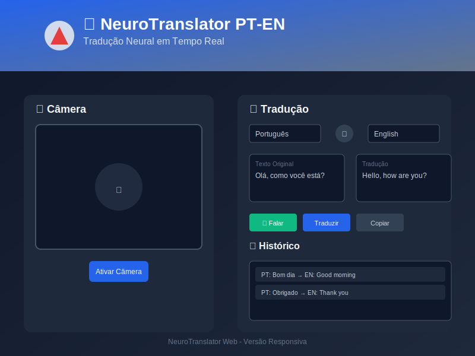

# 🧠 NeuroTranslator v4.0

<div align="center">
  
[](https://github.com/flaviohenriquehb777/NeuroTranslator_PT_EN/blob/main/LICENSE.md)
[](https://flaviohenriquehb777.github.io/NeuroTranslator_PT_EN/)
[](https://github.com/flaviohenriquehb777/NeuroTranslator_PT_EN)

</div>

<div align="center">
  <a href="https://flaviohenriquehb777.github.io/NeuroTranslator_PT_EN/">
    
  </a>
</div>

<div align="center">
  <strong>🚀 <a href="https://flaviohenriquehb777.github.io/NeuroTranslator_PT_EN/">Acesse a Aplicação Web</a></strong>
</div>

## 📋 Sumário

- [Visão Geral](#-visão-geral)
- [O que há de novo na v4.0](#-o-que-há-de-novo-na-v40)
- [Idiomas Suportados](#-idiomas-suportados)
- [Aplicação Web](#-aplicação-web)
- [Sistema de Vozes Neurais](#-sistema-de-vozes-neurais)
- [Atalhos de Teclado](#-atalhos-de-teclado)
- [Arquitetura do Sistema](#️-arquitetura-do-sistema)
- [Estrutura do Projeto](#-estrutura-do-projeto)
- [Instalação e Uso](#-instalação-e-uso)
- [Desenvolvimento](#-desenvolvimento)
- [Contribuição](#-contribuição)
- [Licença](#-licença)

---

## 🌟 Visão Geral

O **NeuroTranslator v4.0** é um sistema avançado de tradução automática em tempo real que utiliza técnicas de Deep Learning e Processamento de Linguagem Natural para tradução multilíngue entre **13 idiomas**. O sistema oferece uma interface web premium com tema escuro sofisticado, reconhecimento de voz, síntese neural de fala, detecção automática de idioma e histórico inteligente de traduções.

## 🆕 O que há de novo na v4.0

### 🌍 Novos Idiomas
Adicionamos suporte completo (tradução + reconhecimento de voz + síntese de fala) para **4 novos idiomas**:
- 🇩🇰 Dinamarquês (da-DK)
- 🇫🇮 Finlandês (fi-FI)
- 🇳🇴 Norueguês Bokmål (nb-NO)
- 🇬🇷 Grego (el-GR)

### 🎙️ Vozes Neurais Premium
O sistema de síntese de voz foi completamente reescrito:
- **Classificação inteligente de vozes** por qualidade (Neural, Premium, Enhanced, Natural, WaveNet)
- **Pré-carregamento de vozes** ao selecionar o idioma de destino
- **Controle de prosódia**: velocidade 0.95x, tom natural
- **Pausa entre frases** de 280ms para ritmo natural de fala
- **Cache de vozes** para evitar reclassificação

### 🧠 Inteligência Avançada
- **Detecção automática de idioma** via análise de trigramas (client-side, sem API)
- **Memória de contexto**: últimas 5 traduções da sessão para consistência
- **Troca inteligente**: ao trocar idiomas, o conteúdo de texto é invertido automaticamente
- **Indicador de confiança**: barra visual com porcentagem de confiança (verde >80%, amarelo 50-80%, vermelho <50%)
- **Atalhos de teclado**: Ctrl+Enter, Ctrl+Shift+S, Ctrl+D

### 🎨 Interface Redesenhada
- **Novo tema escuro premium**: base deep navy (#0a0e1a), indigo elétrico (#6366f1) como acento principal
- **Seletores de idioma em pílulas**: chips interativos com bandeiras e transições suaves
- **Animação neural no cabeçalho**: rede neural animada com canvas leve
- **Shimmer de carregamento**: animação cintilante durante a tradução
- **Gaveta de histórico**: painel deslizante lateral (bottom sheet no mobile)
- **Modal de atalhos**: visualização elegante dos atalhos de teclado
- **Micro-interações**: feedback háptico, cópia com animação, easing cubic-bezier
- **Tipografia Inter**: fonte moderna do Google Fonts

### ⚡ Performance & PWA
- **Debounce de 300ms** na tradução automática
- **Cache de traduções** no Service Worker para uso offline/repetido
- **Limite de cache** com evição automática (máx. 100 entradas)
- **Bundle otimizado**: apenas ~7.7KB gzipped

## 🎯 Idiomas Suportados

| # | Idioma | Código | Bandeira | Reconhecimento de Voz | Síntese de Fala |
|---|--------|--------|----------|----------------------|-----------------|
| 1 | Português (Brasil) | pt-BR | 🇧🇷 | ✅ | ✅ |
| 2 | Inglês (EUA) | en-US | 🇺🇸 | ✅ | ✅ |
| 3 | Espanhol (Espanha) | es-ES | 🇪🇸 | ✅ | ✅ |
| 4 | Francês (França) | fr-FR | 🇫🇷 | ✅ | ✅ |
| 5 | Alemão (Alemanha) | de-DE | 🇩🇪 | ✅ | ✅ |
| 6 | Italiano (Itália) | it-IT | 🇮🇹 | ✅ | ✅ |
| 7 | Russo (Rússia) | ru-RU | 🇷🇺 | ✅ | ✅ |
| 8 | Chinês (Mandarim) | zh-CN | 🇨🇳 | ✅ | ✅ |
| 9 | Japonês (Japão) | ja-JP | 🇯🇵 | ✅ | ✅ |
| 10 | Dinamarquês (Dinamarca) | da-DK | 🇩🇰 | ✅ | ✅ |
| 11 | Finlandês (Finlândia) | fi-FI | 🇫🇮 | ✅ | ✅ |
| 12 | Norueguês Bokmål | nb-NO | 🇳🇴 | ✅ | ✅ |
| 13 | Grego (Grécia) | el-GR | 🇬🇷 | ✅ | ✅ |

> **Nota:** A disponibilidade de reconhecimento e síntese de voz depende do suporte do navegador e pode variar entre idiomas e plataformas.

## 🌐 Aplicação Web

### 🎨 Interface Premium v4.0

A interface foi completamente redesenhada com um visual de nível profissional:

- **🌌 Tema Deep Navy**: Base escura sofisticada (#0a0e1a) com acentos em indigo elétrico
- **✨ Glass Morphism**: Efeitos de vidro translúcido com blur, bordas sutis e sombras profundas
- **🧬 Cabeçalho Neural**: Animação de rede neural com canvas leve (responde a `prefers-reduced-motion`)
- **💊 Seletores de Pílula**: Chips de idioma com bandeiras, scroll horizontal, seleção animada
- **📱 Bottom Sheet Mobile**: Histórico como painel inferior deslizante no mobile
- **⚡ Micro-animações**: Transições suaves com easing personalizado, feedback háptico
- **🔤 Tipografia Inter**: Fonte moderna para legibilidade e estética premium

### 🔧 Funcionalidades Web

- 🎤 **Reconhecimento de Voz**: Captura de áudio em tempo real com detecção automática de término
- 🔊 **Síntese Neural**: Vozes premium classificadas por qualidade com pausa natural entre frases
- 🧠 **Detecção de Idioma**: Identifica automaticamente o idioma do texto digitado
- 📊 **Indicador de Confiança**: Barra visual que mostra a precisão da tradução
- 📋 **Histórico Inteligente**: Gaveta lateral com filtro por par de idiomas e cards interativos
- ⌨️ **Atalhos de Teclado**: Acesso rápido às funções principais
- 💾 **Cache Offline**: Traduções cacheadas para uso sem internet
- 🔄 **Troca Inteligente**: Swap bidirecional de idiomas e texto

## 🎙️ Sistema de Vozes Neurais

O v4.0 introduz um motor de vozes completamente novo:

### Como Funciona

1. **Descoberta**: O sistema obtém todas as vozes disponíveis via `speechSynthesis.getVoices()`
2. **Classificação**: Cada voz recebe uma pontuação baseada em:
   - 🏆 **+20 pts**: Nome contém "Neural"
   - 🥇 **+18 pts**: Nome contém "WaveNet"
   - 🥈 **+16 pts**: Nome contém "Premium"
   - 🥉 **+12 pts**: Nome contém "Enhanced"
   - 📌 **+10 pts**: Nome contém "Natural"
   - 🌐 **+3 pts**: Voz de nuvem (não local)
   - 🎯 **+5 pts**: Correspondência exata do idioma BCP 47
3. **Cache**: A melhor voz por idioma é armazenada em cache
4. **Pré-carregamento**: Vozes são pré-carregadas ao selecionar o idioma
5. **Prosódia**: Velocidade 0.95x com pausas de 280ms entre frases

### Vozes Preferidas por Idioma

Cada idioma tem uma lista de palavras-chave preferidas para seleção de vozes. O sistema prioriza vozes neurais/premium quando disponíveis no navegador.

## ⌨️ Atalhos de Teclado

| Atalho | Ação |
|--------|------|
| `Ctrl + Enter` | Traduzir texto |
| `Ctrl + Shift + S` | Ativar/desativar reconhecimento de voz |
| `Ctrl + D` | Trocar idiomas (swap) |
| `Esc` | Fechar painéis e modais |

> Use o botão **?** na interface para visualizar os atalhos a qualquer momento.

## 🏗️ Arquitetura do Sistema

### 💻 Stack Tecnológico

#### **Frontend Web**
- **HTML5**: Estrutura semântica com SEO otimizado (Schema.org, Open Graph, Twitter Cards)
- **CSS3**: Design system completo com tokens CSS, glassmorphism, micro-animações
- **TypeScript**: Código fortemente tipado com classes ES2020
- **Vite**: Build tool com output IIFE (bundle único, ~7.7KB gzipped)
- **Google Fonts**: Tipografia Inter para interface premium

#### **Web APIs**
- **Web Speech API**: Reconhecimento de fala (SpeechRecognition)
- **Speech Synthesis API**: Síntese de fala com motor de classificação de vozes
- **Clipboard API**: Cópia para área de transferência
- **Vibration API**: Feedback háptico em dispositivos móveis
- **Canvas API**: Animação de rede neural no cabeçalho

#### **Proxy Node.js (Infraestrutura)**
- **Express**: Servidor proxy para normalizar CORS
- **Rate Limiting**: Controle de requisições por IP
- **Cache In-Memory**: Cache de traduções com TTL configurável

#### **APIs de Tradução**
- **MyMemory** (primário): API gratuita com indicador de confiança
- **LibreTranslate** (fallback): Múltiplos endpoints de fallback
- **Proxy Local** (desenvolvimento): Roteamento via Express em localhost:3000

#### **PWA**
- **Service Worker**: Cache stale-while-revalidate para assets estáticos
- **Translation Cache**: Cache separado para respostas de tradução (máx. 100 entradas)
- **Web App Manifest**: Ícones para todas as plataformas, modo standalone

#### **Backend Python (Opcional)**
- **Python 3.8+**: Pesquisa e protótipos
- **Transformers / PyTorch**: Modelos de tradução neural (não ativo na versão web)
- **FastAPI**: API REST (opcional)

## 📁 Estrutura do Projeto

```
NeuroTranslator_PT_EN/
├── 🌐 web/                          # Aplicação Web
│   ├── index.html                   # Interface principal (v4.0)
│   ├── manifest.json                # PWA manifest
│   ├── sw.js                        # Service Worker (v4.0 com cache de traduções)
│   ├── favicon*.png                 # Ícones para todas as plataformas
│   ├── assets/
│   │   ├── css/
│   │   │   └── styles.css           # Design system completo (v4.0)
│   │   ├── ts/
│   │   │   └── script-optimized.ts  # Fonte TypeScript (v4.0)
│   │   ├── js/
│   │   │   └── script-optimized.js  # Bundle IIFE gerado pelo Vite
│   │   └── images/                  # Logo, preview e ícones
│   └── tests/                       # Testes Vitest (frontend)
├── 🧰 infra/                        # Infraestrutura
│   ├── proxy/
│   │   └── server.js                # Proxy Express (CORS/cache/rate limit)
│   ├── vercel/                      # Config Vercel (opcional)
│   └── vercel.json                  # Roteamento Vercel
├── 🐍 src/                          # Backend Python (opcional)
│   ├── audio/                       # Módulos de áudio
│   ├── translation/                 # Módulos de tradução
│   └── utils/                       # Utilitários
├── 📚 notebooks/                    # Jupyter Notebooks (pesquisa)
├── 📖 docs/                         # Documentação adicional
├── 📦 requirements.txt              # Dependências Python
├── package.json                     # Scripts npm (build/lint/test/proxy)
├── tsconfig.json                    # Configuração TypeScript
├── vite.config.ts                   # Build com Vite (IIFE output)
└── README.md                        # Esta documentação
```

## 🚀 Instalação e Uso

### 📱 Uso Web (Recomendado)

1. **Acesso Direto**: [https://flaviohenriquehb777.github.io/NeuroTranslator_PT_EN/](https://flaviohenriquehb777.github.io/NeuroTranslator_PT_EN/)

2. **Servidor Local**:
   ```bash
   # Clone o repositório
   git clone https://github.com/flaviohenriquehb777/NeuroTranslator_PT_EN.git
   cd NeuroTranslator_PT_EN

   # Instale as dependências
   npm install

   # Build do TypeScript
   npm run build

   # Inicie um servidor local
   python -m http.server 8000 --directory web

   # Acesse: http://localhost:8000
   ```

3. **Com Proxy Local** (para desenvolvimento):
   ```bash
   # Em um terminal, inicie o proxy
   npm run proxy

   # Em outro terminal, sirva os arquivos
   python -m http.server 8000 --directory web
   ```

### 🐍 Instalação Python (Pesquisa/Opcional)

```bash
# Crie um ambiente virtual
python -m venv venv
source venv/bin/activate  # Linux/Mac
# ou
venv\Scripts\activate     # Windows

# Instale as dependências
pip install -r requirements.txt

# Execute a aplicação
python main.py
```

## 🔧 Desenvolvimento

### 📋 Pré-requisitos
- **Node.js** 18+ (para build e ferramentas de desenvolvimento)
- **Python 3.8+** (opcional, para backend)
- **Navegador moderno** com suporte a Web Speech API

### 🛠️ Scripts de Desenvolvimento

```bash
npm run build      # Gera web/assets/js/script-optimized.js via Vite
npm run typecheck  # Verificação de tipos TypeScript (tsc --noEmit)
npm run lint       # ESLint no código TypeScript
npm test           # Testes com Vitest
npm run proxy      # Inicia proxy Express em http://localhost:3000
```

### 🔄 Migração v3.0 → v4.0

As principais mudanças de migração são:

1. **HTML**: Interface completamente reestruturada — seletores `<select>` substituídos por pills JS-rendered
2. **CSS**: Design system reescrito com novos tokens de cor e layout
3. **TypeScript**: Classe `NeuroTranslatorWeb` refatorada com `VoiceEngine`, detecção de idioma, sistema de histórico com drawer
4. **Service Worker**: Reescrito com cache de traduções separado
5. **Manifest**: Cores atualizadas para o novo tema

> **Nota**: Não há novas dependências npm. O bundle continua sendo um único IIFE file.

### 🧪 Testes

```bash
npm test
```

## 🤝 Contribuição

1. **Fork** o projeto
2. Crie uma **branch** para sua feature (`git checkout -b feature/AmazingFeature`)
3. **Commit** suas mudanças (`git commit -m 'Add some AmazingFeature'`)
4. **Push** para a branch (`git push origin feature/AmazingFeature`)
5. Abra um **Pull Request**

### 📝 Diretrizes de Contribuição
- Siga os padrões de código existentes
- Adicione testes para novas funcionalidades
- Atualize a documentação quando necessário
- Use commits semânticos

## 📄 Licença

Este projeto está licenciado sob a Licença MIT — veja o arquivo [LICENSE.md](LICENSE.md) para detalhes.

## 🙏 Agradecimentos

- **Hugging Face** — Modelos de tradução neural
- **Google** — Web Speech API, fonte Inter
- **Mozilla** — Ferramentas de desenvolvimento web
- **Comunidade Open Source** — Bibliotecas e frameworks utilizados

---

## 📞 Contato

Se tiver alguma dúvida, sugestão ou quiser colaborar, sinta-se à vontade para entrar em contato:

• **Nome:** Flávio Henrique Barbosa

• **LinkedIn:** [Flávio Henrique Barbosa | LinkedIn](https://www.linkedin.com/in/fl%C3%A1vio-henrique-barbosa-38465938)

• **Email:** [flaviohenriquehb777@outlook.com](mailto:flaviohenriquehb777@outlook.com)

---

<div align="center">
  <strong>Desenvolvido com ❤️ por <a href="https://github.com/flaviohenriquehb777">Flávio Henrique</a></strong>
</div>

<div align="center">
  <a href="https://flaviohenriquehb777.github.io/NeuroTranslator_PT_EN/">🚀 Experimente Agora</a> •
  <a href="https://github.com/flaviohenriquehb777/NeuroTranslator_PT_EN/issues">🐛 Reportar Bug</a> •
  <a href="https://github.com/flaviohenriquehb777/NeuroTranslator_PT_EN/discussions">💬 Discussões</a>
</div>
