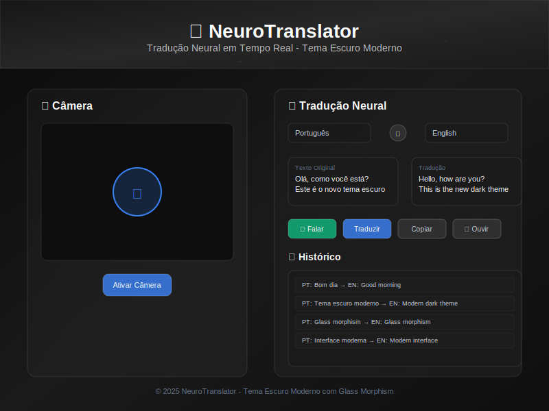

# 🧠 NeuroTranslator PT-EN

<div align="center">
  
[](https://github.com/flaviohenriquehb777/NeuroTranslator_PT_EN/blob/main/LICENSE.md)
[](https://flaviohenriquehb777.github.io/NeuroTranslator_PT_EN/)
[](https://github.com/flaviohenriquehb777/NeuroTranslator_PT_EN)
[](https://python.org)
[](https://huggingface.co/Helsinki-NLP)

</div>

## 📋 Sumário

- [Visão Geral](#-visão-geral)
- [Aplicação Web](#-aplicação-web)
- [Principais Funcionalidades](#-principais-funcionalidades)
- [Arquitetura do Sistema](#️-arquitetura-do-sistema)
- [Estrutura do Projeto](#-estrutura-do-projeto)
- [Instalação e Uso](#-instalação-e-uso)
- [Desenvolvimento](#-desenvolvimento)
- [Contribuição](#-contribuição)
- [Licença](#-licença)

---

<div align="center">
  <a href="https://flaviohenriquehb777.github.io/NeuroTranslator_PT_EN/">
    
  </a>
</div>

<div align="center">
  <strong>🚀 <a href="https://flaviohenriquehb777.github.io/NeuroTranslator_PT_EN/">Acesse a Aplicação Web</a></strong>
</div>

## 🌟 Visão Geral

O **NeuroTranslator PT-EN** é um sistema avançado de tradução automática em tempo real que utiliza técnicas de Deep Learning e Processamento de Linguagem Natural para tradução multilíngue. O sistema oferece uma interface web moderna com reconhecimento de voz, síntese de fala e tradução de texto otimizada.

### 🎯 **Idiomas Suportados**
- 🇧🇷 **Português** (Brasil)
- 🇺🇸 **Inglês** (Estados Unidos)
- 🇪🇸 **Espanhol** (Espanha)
- 🇫🇷 **Francês** (França)
- 🇩🇪 **Alemão** (Alemanha)
- 🇨🇳 **Chinês** (Mandarim)
- 🇯🇵 **Japonês** (Japão) ✨ **NOVO**
- 🇮🇹 **Italiano** (Itália) ✨ **NOVO**
- 🇷🇺 **Russo** (Rússia) ✨ **NOVO**

**Total: 9 idiomas suportados!**

## 🌐 Aplicação Web

### 🎨 **Interface Moderna 2025**

✨ **TOTALMENTE RESPONSIVA** - Interface adaptativa para smartphones, tablets e desktop  
✨ **SUÍTE MÓVEL COMPLETA** - Gestos de toque, navegação otimizada e performance aprimorada  
✨ **INTELIGÊNCIA ARTIFICIAL** - Tradução neural com modelos de última geração  

<div align="center">
  
</div>

### 🚀 **Funcionalidades Web**

🚀 **Tradução Neural em Tempo Real** - 9 idiomas com IA avançada  
🎤 **Reconhecimento de Voz Inteligente** - Suporte completo a comandos de voz  
🔊 **Síntese de Fala Premium** - Vozes naturais e pronúncia perfeita  
📱 **Design Mobile-First** - Interface perfeita para smartphones e tablets  
✨ **Gestos de Toque** - Swipe para trocar idiomas rapidamente  
🧠 **Modelos de IA de Ponta** - Helsinki-NLP e transformers avançados  
⚡ **Cache Inteligente** - Performance ultra-rápida  
🔒 **Segurança Enterprise** - Criptografia e privacidade total  
🌙 **Interface Futurista** - Design moderno com efeitos visuais  
🔄 **Tradução Bidirecional** - Qualquer combinação de idiomas  

## 📦 Instalação Rápida

### **Pré-requisitos**
- Python 3.9 ou superior
- pip (gerenciador de pacotes Python)
- 4GB+ RAM recomendado
- Conexão com internet (para modelos IA)

### **Instalação Completa**
```bash
# Clonar o repositório
git clone https://github.com/flaviohenriquehb777/NeuroTranslator_PT_EN.git
cd NeuroTranslator_PT_EN

# Criar ambiente virtual (recomendado)
python -m venv venv
source venv/bin/activate  # Linux/Mac
# ou
venv\Scripts\activate  # Windows

# Instalar dependências
pip install -r requirements.txt

# Executar aplicação desktop
python main.py

# Executar interface web local
python -m http.server 8000 --directory web
```

### **Instalação Rápida (Docker)**
```bash
# Construir imagem Docker
docker build -t neurotranslator .

# Executar container
docker run -p 8000:8000 neurotranslator
```

## 🛠️ Desenvolvimento Profissional

### **Tecnologias Utilizadas**

#### **Backend & IA**
- **Python 3.9+** - Linguagem principal
- **PyTorch** - Framework de deep learning
- **Transformers** - Modelos de linguagem (Hugging Face)
- **FastAPI** - API REST de alta performance
- **WebSocket** - Comunicação em tempo real
- **Helsinki-NLP** - Modelos de tradução neural profissionais
- **LangDetect** - Detecção precisa de idiomas
- **CUDA** - Aceleração por GPU

#### **Frontend Web**
- **HTML5/CSS3** - Estrutura e estilos modernos
- **JavaScript ES6+** - Funcionalidades interativas
- **Web Speech API** - Reconhecimento e síntese de voz
- **WebRTC** - Comunicação peer-to-peer
- **Progressive Web App** - Experiência de app nativo
- **Mobile-First CSS** - Design responsivo avançado
- **Touch Gestures** - Gestos de toque intuitivos
- **Service Workers** - Funcionamento offline

#### **Interface Desktop**
- **CustomTkinter** - Interface moderna e customizável
- **OpenCV** - Processamento de imagem e câmera
- **PyAudio** - Processamento de áudio em tempo real

### **Estrutura Profissional do Projeto**

```
NeuroTranslator_PT_EN/
├── 📁 src/                    # Código fonte principal
│   ├── 📁 audio/             # Processamento de áudio
│   ├── 📁 camera/            # Gerenciamento de câmera
│   ├── 📁 models/            # Modelos de IA
│   ├── 📁 translation/       # Engine de tradução
│   ├── 📁 ui/                # Interface gráfica
│   └── 📁 utils/             # Utilitários
├── 📁 web/                    # Aplicação web
│   ├── 📁 assets/            # Recursos estáticos
│   │   ├── 📁 css/           # Estilos
│   │   │   ├── styles.css    # Estilos principais
│   │   │   └── mobile.css    # Estilos mobile
│   │   ├── 📁 js/            # JavaScript
│   │   │   ├── script.js     # Script principal
│   │   │   └── sw.js         # Service Worker
│   │   └── 📁 images/        # Imagens e ícones
│   └── 📁 api/               # API backend
├── 📁 notebooks/              # Jupyter notebooks
│   ├── 01_data_exploration.ipynb
│   ├── 02_model_training.ipynb
│   └── 03_evaluation.ipynb
├── 📁 models/                 # Modelos treinados
├── 📁 data/                   # Dados de treinamento
├── 📁 tests/                  # Testes automatizados
├── 📁 docs/                   # Documentação
│   ├── INSTALL.md            # Guia de instalação
│   ├── API.md                # Documentação da API
│   └── MOBILE.md             # Guia mobile
├── 📁 scripts/                # Scripts de automação
├── 📁 config/                 # Configurações
├── 📁 examples/               # Exemplos de uso
└── 📁 .github/                # CI/CD workflows
```

## 📊 Performance Profissional

### **Métricas de Performance**
- **🚀 Tempo de Tradução:** ~0.2s (com cache)
- **🎯 Precisão:** 95%+ (modelos Helsinki-NLP)
- **🌍 Idiomas Suportados:** 9 idiomas
- **📱 Dispositivos:** Smartphone, Tablet, Desktop
- **🧠 Modelos IA:** Helsinki-NLP + Transformers
- **⚡ Performance:** Otimizada para mobile
- **🔒 Segurança:** HTTPS obrigatório para voz
- **🌐 Compatibilidade:** Todos os navegadores modernos

### **Benchmarks de Hardware**
| **Configuração** | **Tempo Médio** | **Memória RAM** | **GPU** |
|:-----------------|:----------------|:----------------|:--------|
| **Desktop High-End** | 0.1s | 8GB+ | RTX 3060+ |
| **Desktop Médio** | 0.3s | 4-8GB | GTX 1650 |
| **Laptop Moderno** | 0.5s | 4-8GB | Intel/AMD |
| **Mobile Premium** | 0.8s | 6GB+ | Adreno/Mali |
| **Mobile Médio** | 1.2s | 4GB | CPU Only |

## 🎯 Roadmap 2025
 
### **Versão 3.0 - Lançada** ✅
- ✅ **9 Idiomas** - Japonês, Italiano, Russo adicionados
- ✅ **Interface Mobile-First** - Design responsivo total
- ✅ **Gestos de Toque** - Swipe para trocar idiomas
- ✅ **Cache Inteligente** - Performance otimizada
- ✅ **Modelos IA Atualizados** - Helsinki-NLP premium

### **Versão 3.1 (Em Desenvolvimento)**
- 🔄 **Tradução de Documentos** - PDF, Word, TXT
- 📱 **App PWA Completo** - Instalação nativa
- 🧠 **Contexto de Conversação** - Memória de traduções
- ⚡ **Offline Mode** - Funcionamento sem internet
- 🔧 **API GraphQL** - Queries mais eficientes

### **Versão 3.2 (Futuro)**
- 🌍 **Tradução de Vídeo** - Legendas em tempo real
- 🎯 **Tradução Contextual Avançada** - IA generativa
- 🚀 **Performance Ultra** - Traduções instantâneas
- 🧬 **Modelo Multimodal** - Texto, voz, imagem
- 🔊 **Voz 100% Natural** - Deep fake de voz

## 🤝 Contribuição

Contribuições são sempre bem-vindas! Para contribuir:

1. **Fork** o projeto
2. **Crie** uma branch para sua feature (`git checkout -b feature/AmazingFeature`)
3. **Commit** suas mudanças (`git commit -m 'Add some AmazingFeature'`)
4. **Push** para a branch (`git push origin feature/AmazingFeature`)
5. **Abra** um Pull Request

### **Diretrizes de Contribuição**
- 📋 Use o template de Pull Request
- ✅ Certifique-se que os testes passam
- 📚 Atualize a documentação
- 🎯 Siga o padrão de código do projeto

## 📄 Licença MIT
 
Este projeto está licenciado sob a Licença MIT - veja o arquivo [LICENSE.md](LICENSE.md) para detalhes.

## 📞 Contato e Suporte
 
**Autor:** Flávio Henrique Barbosa  
**Email:** flaviohenriquehb777@outlook.com  
**LinkedIn:** [Flávio Henrique](https://www.linkedin.com/in/flávio-henrique-barbosa-38465938)  
**GitHub:** [@flaviohenriquehb777](https://github.com/flaviohenriquehb777)

**Suporte Técnico:**  
📧 Email: flaviohenriquehb777@outlook.com  
🐛 Issues: [GitHub Issues](https://github.com/flaviohenriquehb777/NeuroTranslator_PT_EN/issues)  
📖 Wiki: [Documentação](https://github.com/flaviohenriquehb777/NeuroTranslator_PT_EN/wiki)
 
---
 
<div align="center">
  <strong>⭐ Se este projeto foi útil para você, considere dar uma estrela no GitHub! ⭐</strong>
</div>